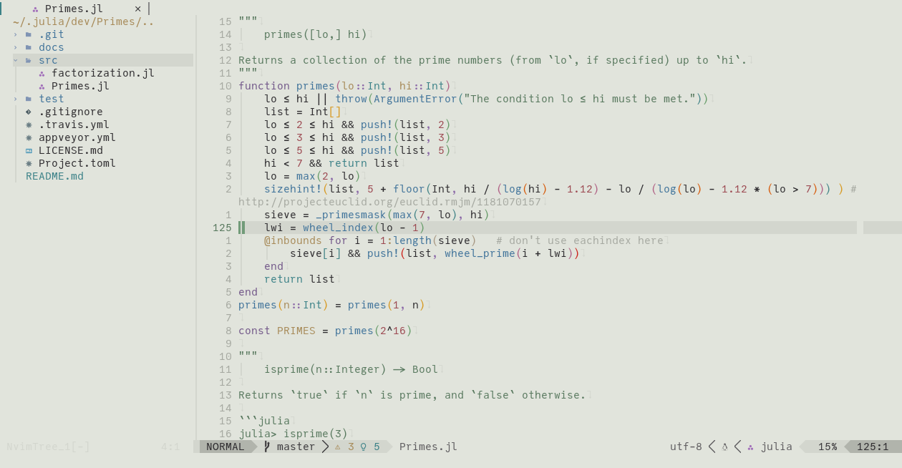
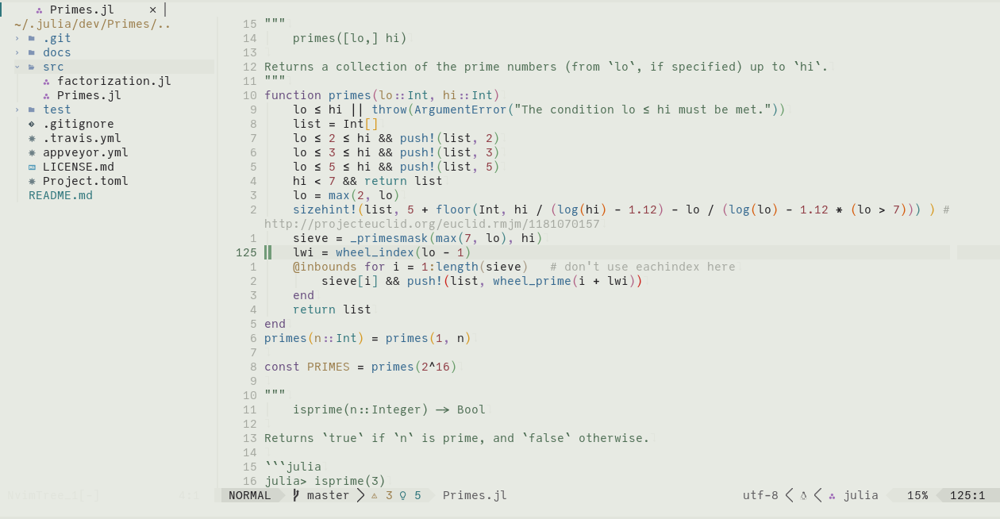
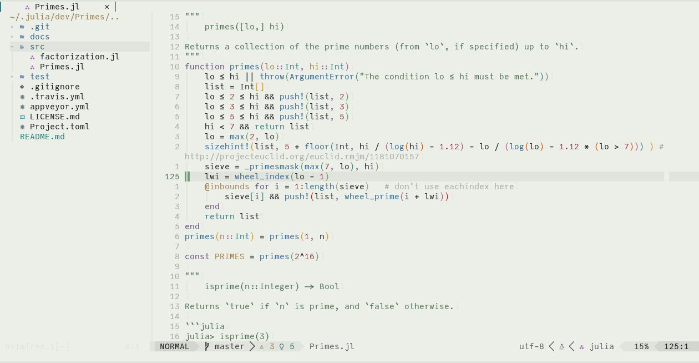
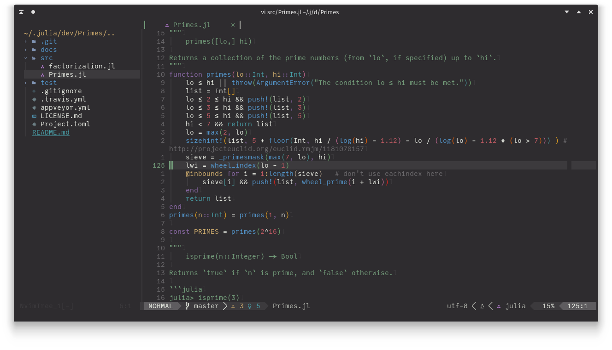
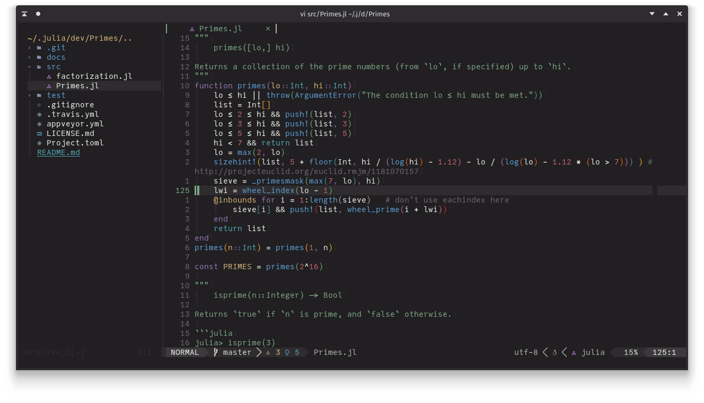
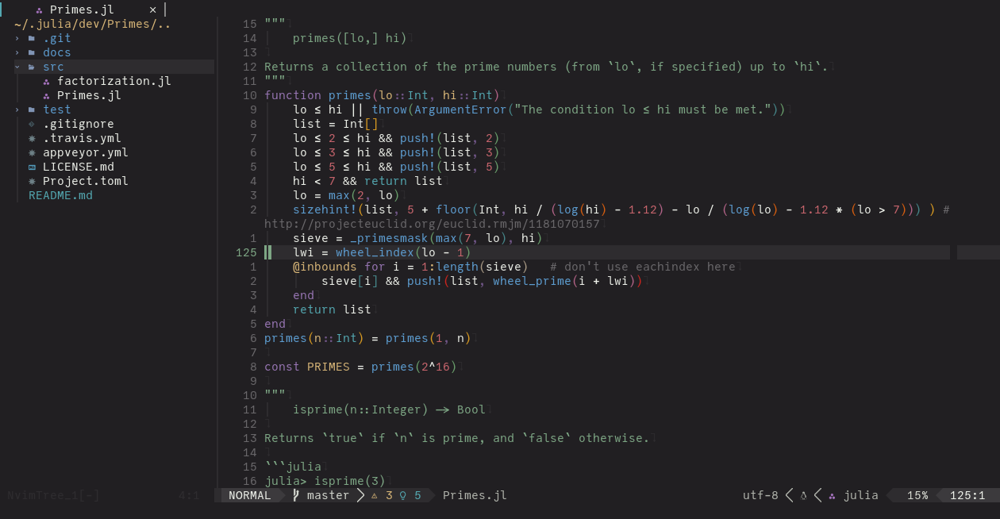

# leaf.nvim

Neovim colorscheme based on the awesome [Leaf KDE Plasma Theme](https://github.com/qewer33/leaf-kde) by @qewer33.

## Installation

Download with your favorite package manager.

```lua
use "daschw/leaf.nvim"
```

## Requirements

- neovim >= 0.6
- truecolor terminal support
- undercurl terminal support (optional)

## Usage

As simple as writing (pasting)

```vim
colorscheme leaf
```

```lua
vim.cmd("colorscheme leaf")
```

## Themes

The default *light* and *dark* themes exactly match the colors from the corresponding KDE Plasma themes.
For those of you who prefer more contrast there are also lighter and darker versions available.
The light theme is the default theme. You can choose a different theme with:

```lua
require("leaf").setup({
    theme = "light", -- default, alternatives: "dark", "lighter", "darker", "lightest", "darkest"
})

-- setup must be called before loading
vim.cmd("colorscheme leaf")
```

### light


### lighter


### lightest


### dark


### darker


### darkest


## Extras

Matching kitty themes are available in [extras](extras/).

## Acknowledgements

- Almost all colors are taken from the [Leaf KDE Plasma Theme](https://github.com/qewer33/leaf-kde) by @qewer33. I just ported the konsole colors to Neovim and kitty.
- I used [kanagawa.nvim](https://github.com/rebelot/kanagawa.nvim) by @rebelot as a template, since this is the first theme I made for Neovim.
