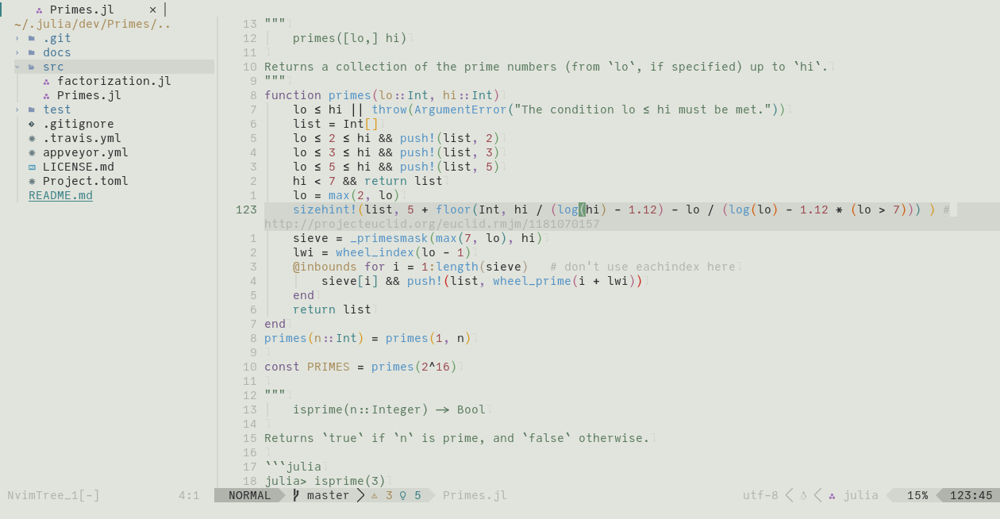

# leaf.nvim

Neovim colorscheme based on the awesome [Leaf KDE Plasma Theme](https://github.com/qewer33/leaf-kde) by @qewer33.




## Installation

Download with your favorite package manager.

```lua
use "daschw/leaf.nvim"
```

## Requirements

- neovim >= 0.6
- truecolor terminal support
- undercurl terminal support (optional)

## Usage

As simple as writing (pasting)

```vim
colorscheme leaf
```

```lua
vim.cmd("colorscheme leaf")
```

## Configuration

By default the light theme is used. You can choose the dark theme with:

```lua
require("leaf").setup({theme = "dark"})

-- setup must be called before loading
vim.cmd("colorscheme leaf")
```

## Extras

* [kitty light](extras/kitty_leaf_light.conf)
* [kitty dark](extras/kitty_leaf_dark.conf)

## Acknowledgements

- Almost all colors are taken from the [Leaf KDE Plasma Theme](https://github.com/qewer33/leaf-kde) by @qewer33. I just ported the konsole colors to Neovim and kitty.
- I used [kanagawa.nvim](https://github.com/rebelot/kanagawa.nvim) by @rebelot as a template, since this is the first theme I made for Neovim.
